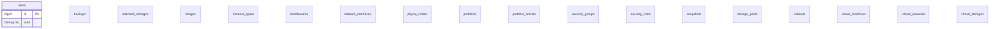

```mermaid
erDiagram
users {
    bigint id PK
    binary(16) uuid

}

backups {

}

attached_storages {

}

images {

}

instance_types {

}

middlewares {}

network_interfaces {}

phycal_nodes {}

portfolios {}

portfolio_articles {}

security_groups {}

security_rules {}

snapshots {}

storage_pools {}

subnets {}

virtual_machines {}

virtual_networks {}

virtual_storages {}

```
