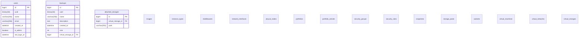

```mermaid
erDiagram
users {
    bigint id PK
    binary(16) uuid
    varchar(256) name
    varchar(256) email
    datetime created_at
    boolean is_admin
    datetime last_login_at
}

backups {
    bigint id PK
    binary(16) uuid
    varchar(256) name
    text description
    datetime created_at
    int size
    bigint virtual_storage_id FK
}

attached_storages {
    bigint id PK
    bigint virtual_storage_id FK
    varchar(255) path
}

images {

}

instance_types {

}

middlewares {}

network_interfaces {}

phycal_nodes {}

portfolios {}

portfolio_articles {}

security_groups {}

security_rules {}

snapshots {}

storage_pools {}

subnets {}

virtual_machines {}

virtual_networks {}

virtual_storages {}

```
